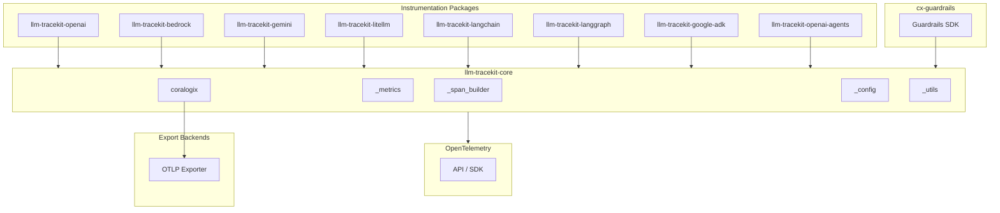
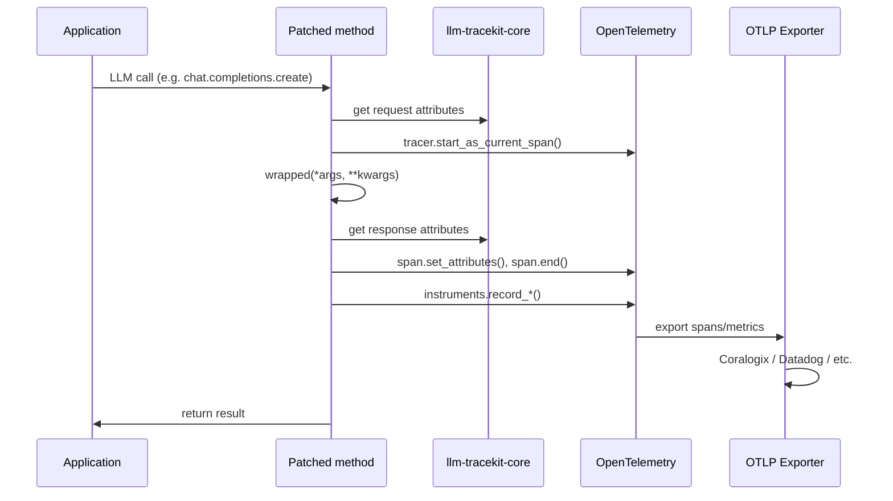

# Architecture

## Components & responsibilities

| Component | Responsibility |
|-----------|----------------|
| **llm-tracekit-core** | Shared span builders, metrics (`Instruments`), Coralogix export (`setup_export_to_coralogix`), content capture config, attribute utilities. All instrumentations depend on it. |
| **Instrumentations** | Each patches a specific LLM provider or framework. Extends `BaseInstrumentor`, uses `wrapt` to wrap target methods, creates spans and records metrics via core. |
| **cx-guardrails** | Content evaluation (PII, prompt injection, toxicity, custom). Separate package; integrates with Coralogix export for trace correlation. |
| **OpenTelemetry** | Tracer, Meter, TracerProvider, MeterProvider, OTLP exporters. Tracekit uses standard OTel APIs. |

### Instrumentation packages

| Package | Target | Patched surface |
|---------|--------|-----------------|
| `llm-tracekit-openai` | OpenAI Python SDK | `Completions.create`, `AsyncCompletions.create` |
| `llm-tracekit-bedrock` | AWS Bedrock | `invoke_model`, `invoke_agent`, `converse` |
| `llm-tracekit-gemini` | Google Gemini | Gemini client methods |
| `llm-tracekit-litellm` | LiteLLM | Callback-based instrumentation |
| `llm-tracekit-langchain` | LangChain | Callback handler |
| `llm-tracekit-langgraph` | LangGraph | Callback handler |
| `llm-tracekit-google-adk` | Google ADK | ADK agent execution |
| `llm-tracekit-openai-agents` | OpenAI Agents SDK | Agent run via tracing processor |

## Data flow

1. Application calls an instrumented LLM method.
2. Wrapper extracts request params (model, messages, etc.) and starts a span.
3. Wrapper invokes the original method.
4. On success: wrapper extracts response (choices, tokens, etc.), sets span attributes, records metrics, ends span.
5. On failure: wrapper records exception via `handle_span_exception`, ends span.
6. OTLP exporter sends spans and metrics to the configured backend.

## Dependencies

- **Core dependencies**: `opentelemetry-api`, `opentelemetry-sdk`, `pydantic`, `wrapt`
- **Per-instrumentation**: Each adds its target SDK (e.g. `openai`, `boto3` for Bedrock)
- **Workspace**: uv workspace; all packages in `pyproject.toml` `[tool.uv.workspace]` members
- **Meta-package**: `llm-tracekit` aggregates optional instrumentations via `[project.optional-dependencies]`

## Failure modes

| Failure | Behavior |
|---------|----------|
| **Instrumentation exception** | `handle_span_exception` records error attributes on span; original exception is re-raised. Application behavior is unchanged. |
| **Exporter failure** | OTLP exporters typically buffer and retry. If export fails, spans may be dropped; application continues. |
| **Content capture disabled** | When `OTEL_INSTRUMENTATION_GENAI_CAPTURE_MESSAGE_CONTENT=False`, message content is not added to spans (privacy/size). |
| **Uninstrument** | `Instrumentor().uninstrument()` removes patches; subsequent calls are not traced. |

## Related documentation

- [Overview](overview.md) — Mental model, workflows, quick start
- [Design principles](design-principles.md) — Strategies, invariants, versioning
- [Testing strategy](testing-strategy.md) — Frameworks, coverage, definition of done
