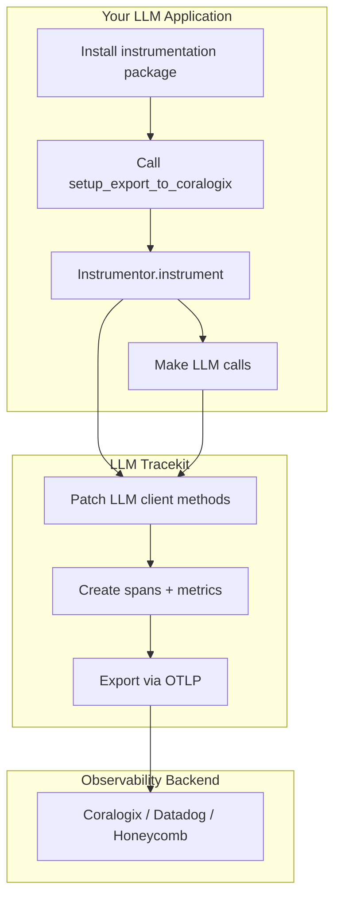

# LLM Tracekit — Overview

If you only read one doc, read this.

## What this is / What this is not

**LLM Tracekit** is an open-source observability toolkit for LLM applications built on OpenTelemetry. It provides:

- **Instrumentations** for LLM providers (OpenAI, AWS Bedrock, Google Gemini) and frameworks (LiteLLM, LangChain, LangGraph, Google ADK, OpenAI Agents SDK)
- **Tracing and metrics** for LLM calls, following OpenTelemetry semantic conventions
- **Coralogix integration** for exporting traces via OTLP
- **Coralogix Guardrails** (`cx-guardrails`) for content moderation, PII detection, prompt injection detection, and custom evaluations

**LLM Tracekit is not:**

- A full observability platform; it connects to your existing backend (Coralogix, Datadog, Honeycomb, etc.)
- A replacement for LLM SDKs; it instruments them transparently
- A general-purpose OpenTelemetry library; it focuses on LLM-specific spans and attributes

## Primary workflows



1. **Instrumentation** — Install a provider/framework package, call `setup_export_to_coralogix()` (or configure your own OTLP exporter), then call `Instrumentor().instrument()`.
2. **Tracing** — LLM calls are wrapped; spans capture model, tokens, latency, and optionally message content.
3. **Export** — Spans and metrics are exported to your configured backend via OTLP.
4. **Guardrails** (optional) — Use `cx-guardrails` to guard prompts and responses before/after LLM calls.

## Quick start

```bash
pip install llm-tracekit-openai
```

```python
from llm_tracekit.openai import OpenAIInstrumentor, setup_export_to_coralogix

setup_export_to_coralogix(
    service_name="my-ai-service",
    capture_content=True,
)

OpenAIInstrumentor().instrument()

from openai import OpenAI
client = OpenAI()
response = client.chat.completions.create(
    model="gpt-4o-mini",
    messages=[{"role": "user", "content": "Hello!"}],
)
```

See the [root README](../README.md) for all provider and framework packages.

## Key concepts

| Concept | Description |
|---------|-------------|
| **Instrumentor** | Each package exposes an `*Instrumentor` class extending OpenTelemetry's `BaseInstrumentor`. Call `.instrument()` to patch target methods. |
| **Core** | `llm-tracekit-core` provides span builders, metrics, Coralogix export, and shared utilities. All instrumentations depend on it. |
| **Patching** | Uses `wrapt.wrap_function_wrapper` to wrap LLM client methods (e.g. `Completions.create`) without modifying application code. |
| **Content capture** | Controlled by `OTEL_INSTRUMENTATION_GENAI_CAPTURE_MESSAGE_CONTENT` or `capture_content` in `setup_export_to_coralogix`. When enabled, spans include prompt/response content. |
| **Guardrails** | `cx-guardrails` is a separate package for content evaluation (PII, prompt injection, toxicity, custom rules) before/after LLM calls. |

## Related documentation

- [Architecture](architecture.md) — Components, data flow, dependencies
- [Design principles](design-principles.md) — Strategies, invariants, versioning
- [Testing strategy](testing-strategy.md) — Frameworks, coverage, definition of done

## Support & ownership

- **License**: Apache 2.0
- **Maintainer**: Coralogix Ltd.
- **Repository**: [github.com/coralogix/llm-tracekit](https://github.com/coralogix/llm-tracekit)
- **Homepage**: [coralogix.com](https://coralogix.com)
